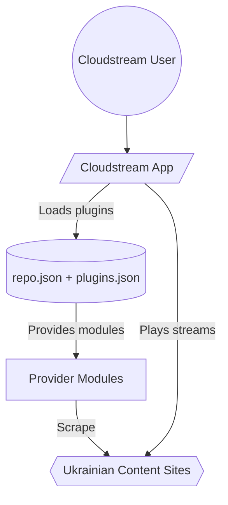

# Project Overview: Cloudstream UA Provider Suite

---

**Purpose of this Document:** High-level snapshot of the Cloudstream Ukraine extensions project: goals, scope, stack, architecture, and quality priorities. This is the source of truth for AI agents working in this repository alongside `noderr_architecture.md`, `noderr_tracker.md`, and `noderr/specs/*`.

---

### 1. Project Goal & Core Problem

* **Goal:** Deliver a reliable set of Cloudstream provider plugins that surface Ukrainian-localized movies, series, anime, and shows from multiple public sources.
* **Core Problem Solved:** Centralize access to Ukrainian-language streaming sources in one place for Cloudstream users without requiring separate apps or manual scraping.

---

### 2. Scope & Key Features (MVP Focus)

* **Minimum Viable Product (MVP) Description:** A consumable plugin repository containing working provider modules for major Ukrainian streaming/translation sites, built via Gradle and distributed through `repo.json` and the GitHub Actions build pipeline.
* **Key Features (In Scope for MVP):**
    * Provider modules for each major source (HdRezka, Eneyida, UAFlix, Uakino, UASerialsPro, AnimeON, AnimeUA, Anitubeinua, BambooUA, CikavaIdeya, HentaiUkr, KinoTron, KinoVezha, KlonTV, Serialno, Teleportal, UASerial, UATuTFun, UFDub, Unimay).
    * Gradle-based build pipeline (local and GitHub Actions) producing `.cs3` artifacts and `plugins.json`.
    * Repository manifest (`repo.json`) pointing to published builds branch.
* **Key Features (Explicitly OUT of Scope for MVP):**
    * New UI/UX or playback logic inside the Cloudstream app itself.
    * Payment, user accounts, or analytics.
    * Server-side backend APIs (all data is scraped client-side via providers).

---

### 3. Target Audience

* **Primary User Group(s):** Cloudstream users seeking Ukrainian-dubbed or subtitled content.
* **Key User Needs Addressed:** Quick discovery and playback of Ukrainian-localized movies/series/anime via a single plugin feed; minimal setup friction.

---

### 4. Technology Stack (Specific Versions)

| Category             | Technology                                      | Specific Version                          | Notes |
|:---------------------|:-------------------------------------------------|:------------------------------------------|:------|
| Language(s)          | Kotlin                                           | 2.1.10                                    | Kotlin Android library modules |
| Build System         | Gradle (wrapper)                                 | Android Gradle Plugin 8.8.2               | Requires JDK 17+ locally |
| Cloudstream Plugin   | com.lagradost:cloudstream3                       | pre-release                               | Main API runtime |
| Cloudstream API      | com.github.Blatzar:CloudstreamApi                | 0.1.6                                     | API helpers |
| HTTP/HTML Utilities  | NiceHttp                                         | 0.4.11                                    | HTTP client |
| HTML Parser          | jsoup                                            | 1.18.3                                    | DOM parsing |
| Testing (Unit)       | JUnit                                            | 4.13.2                                    | Used in modules; no tests present yet |
| Android SDK          | Compile/Target                                   | 35                                        | minSdk 21 |
| Version Control      | Git                                              | N/A                                       | Repo hosted on GitHub |
| Deployment Target    | GitHub Actions builds branch + repo.json feed    | N/A                                       | Produces `.cs3` artifacts |
| Other                | kotlinx-coroutines-test                          | 1.10.1                                    | For potential async tests |

* **Tech Stack Rationale:** Cloudstream plugins are Kotlin-based Android libraries; Gradle + AGP provide the required tooling. Cloudstream3 API plus NiceHttp/jsoup enable scraping and link extraction for external streaming sources.

---

### 5. High-Level Architecture

* **Architectural Style:** Multi-module plugin library; each provider is a self-contained Cloudstream `MainAPI` module built by a shared Gradle root and distributed as `.cs3` artifacts.
* **Key Components & Interactions:** Gradle root config builds provider modules; GitHub Actions packages outputs into `builds` branch; `repo.json` advertises the feed; the Cloudstream app consumes the manifest and loads provider modules which scrape external sites for media links.
* **Diagram (Mermaid):**

---

### 6. Core Components/Modules (Logical Breakdown)

* **Provider Suite:** Individual Cloudstream `MainAPI` modules for each source listed in the MVP scope.
* **Build & Packaging:** Gradle root configuration, version catalog, and GitHub Actions workflow (`build.yml`) to produce `.cs3` artifacts and `plugins.json`.
* **Distribution Manifest:** `repo.json` pointing clients to the builds branch artifacts.

---

### 7. Key UI/UX Considerations

* **Overall Feel:** Seamless plugin consumption inside Cloudstream; no custom UI in this repo.
* **Key Principles:**
    * Reliability: Providers should return playable links with minimal errors.
    * Performance: Fast search/load responses by efficient scraping and caching.
    * Safety: Avoid breaking the Cloudstream app via bad metadata or malformed links.

---

### 8. Coding Standards & Conventions

* **Primary Style Guide:** Idiomatic Kotlin; follow Cloudstream provider patterns.
* **Formatter:** Kotlin/IntelliJ defaults (no formatter config in repo).
* **Linter:** None configured; rely on compiler and CI build.
* **File Naming Conventions:** Providers under `<Module>/src/main/kotlin/com/lagradost/*Provider.kt`; plugin entrypoints `*ProviderPlugin.kt`; Gradle scripts in `build.gradle.kts`.
* **Commit Message Convention:** Prefer Conventional Commits (e.g., `feat: add hdrezka settings cache`).
* **Other Key Standards:**
    * Prefer sealed scraping paths and robust null handling.
    * Reuse shared HTTP/DOM helpers from Cloudstream API.
    * Keep provider descriptions and metadata accurate in `build.gradle.kts`.

---

### 9. Key Quality Criteria Focus
1. **Reliability:** Providers should return stable links and handle CDN/mirror changes gracefully.
2. **Maintainability:** Each provider remains isolated with clear metadata and minimal duplication.
3. **Resilience to Site Changes:** Use flexible selectors and fallback logic where possible.
4. **Testability:** Add smoke tests to catch breaking changes early.

---

### 10. Testing Strategy

* **Required Test Types for MVP:**
    * Unit/Component: Lightweight parsing/link-generation tests per provider (planned).
    * Smoke: Build-and-load checks to ensure providers compile and basic endpoints respond (planned).
* **Testing Framework(s) & Version(s):** JUnit 4.13.2 (already declared); kotlinx-coroutines-test for async helpers.
* **Test File Location & Naming:** Within each provider module (e.g., `src/test/java/.../*Test.kt`).
* **Minimum Code Coverage Target:** Aim for smoke coverage on main flows; full coverage not enforced yet.

---

### 11. Initial Setup Steps (for new developers)

1. **Clone Repository:** `git clone https://github.com/CakesTwix/cloudstream-extensions-uk.git`
2. **Install Tools:** JDK 17+, Android SDK (if running full builds locally), Node/Python optional.
3. **Set JAVA_HOME:** Point to JDK install (required for Gradle wrapper).
4. **Install Dependencies:** Gradle wrapper will download dependencies on first run.
5. **Build Provider(s):** `.\gradlew.bat HdRezkaProvider:make` (or `make`/`makePluginsJson` for full set) after JAVA_HOME is set.
6. **Run Tests:** `.\gradlew.bat testReleaseUnitTest` (add smoke tests first).
7. **Package Manifest:** GitHub Actions `build.yml` already publishes to `builds` branch; local `makePluginsJson` writes `build/plugins.json`.

---

### 12. Key Architectural Decisions & Rationale

* **Decision 1:** Multi-module Gradle project with one module per provider.  
  **Rationale:** Keeps scraping logic isolated and enables selective builds/releases.
* **Decision 2:** Use Cloudstream3 pre-release + Cloudstream API helpers.  
  **Rationale:** Aligns with upstream app runtime and available helper utilities.
* **Decision 3:** GitHub Actions build and publish to `builds` branch.  
  **Rationale:** Automates artifact generation and keeps feed updated for end users.

---

### 13. Repository Link

* `https://github.com/CakesTwix/cloudstream-extensions-uk`

---

### 14. Dependencies & Third-Party Services

* **External Content Sites:** HdRezka, Eneyida, UAFlix, Uakino, UASerialsPro, AnimeON, AnimeUA, Anitubeinua, BambooUA, CikavaIdeya, HentaiUkr, KinoTron, KinoVezha, KlonTV, Serialno, Teleportal, UASerial, UATuTFun, UFDub, Unimay.
* **Purpose:** Provide media metadata and streaming links.
* **Credentials:** None in repository; all scraping is anonymous.

---

### 15. Security Considerations (High-Level)

* No authentication flows or stored secrets in this repo.
* Providers should avoid logging sensitive user info; respect Cloudstream runtime constraints.
* Keep dependencies updated to avoid vulnerable transitive packages.

---

### 16. Performance Requirements (Qualitative)

* Providers should resolve search/load in a few seconds even with fallbacks.
* Favor efficient selectors and minimal HTTP calls; cache mirror info when possible.

---

### 17. Monitoring & Observability (Basic)

* Rely on Cloudstream logs and manual testing for now.
* Future: add smoke tests to CI to catch broken selectors or dead mirrors early.

---

### 18. Links to Other Noderr v1.9 Artifacts

* `noderr/noderr_architecture.md` — Unified architecture diagram and NodeIDs.
* `noderr/noderr_tracker.md` — Status map for all components.
* `noderr/specs/` — Component specs (existing + missing).
* `noderr/environment_context.md` — Completed environment profile.

---

Environment focus: DEVELOPMENT; see `noderr/environment_context.md` for validated commands and tooling.
